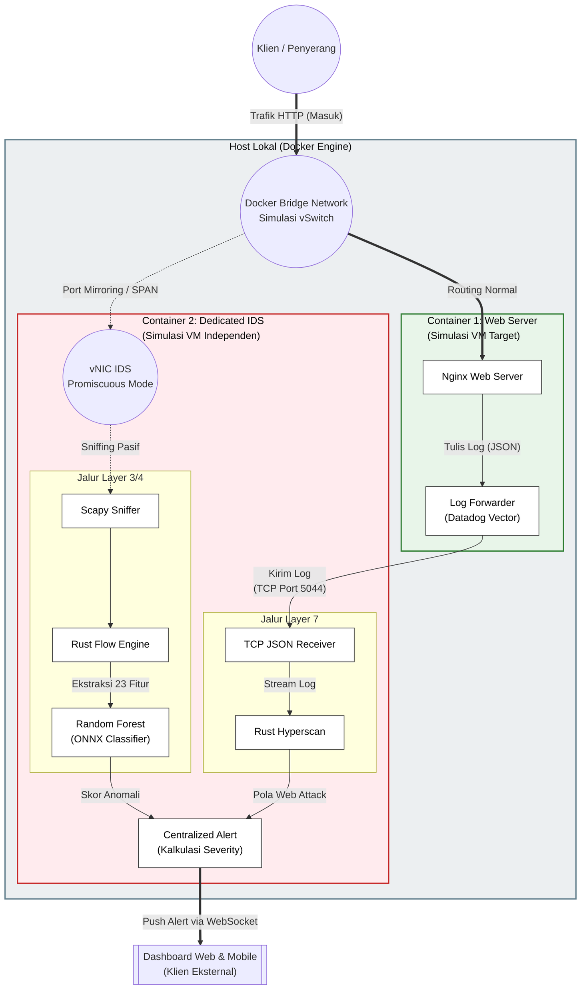
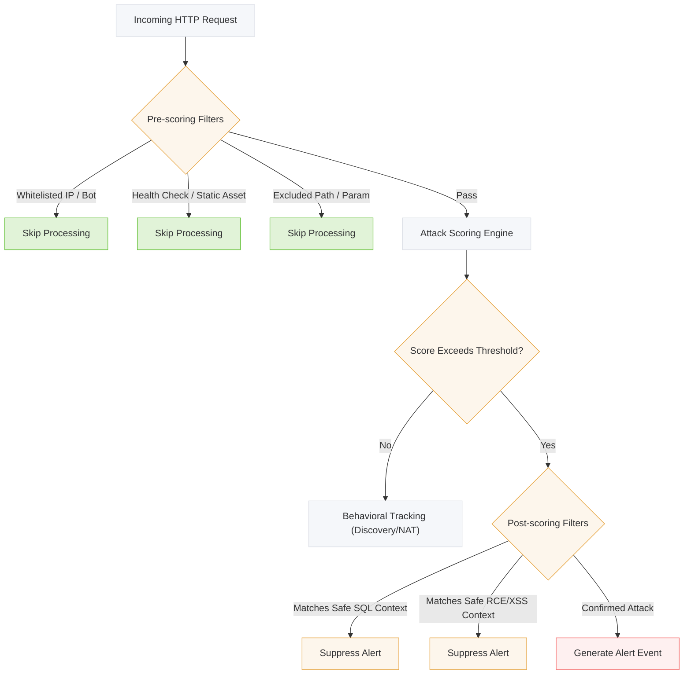

# 🛡️ Isolation Forest Log Analysis

**Passive Intrusion Detection System** — detects web attacks (SQLi, XSS, RCE), DDoS, and anomalous network traffic using Isolation Forest ML and signature-based analysis.

> This system operates as a standard **IDS** (Intrusion Detection System): it monitors and alerts on all attack attempts, whether successful or not, giving full visibility into who is probing your infrastructure.

---

## Architecture



---

## Detection Pipeline



---

## Project Structure

```
isolation-forest-log-analysis/
├── app/
│   ├── main.py                    # FastAPI server + startup
│   ├── core/
│   │   ├── proxy_addon.py         # mitmproxy addon (HTTP interception)
│   │   ├── scanner.py             # Network packet monitor (Scapy + Isolation Forest)
│   │   ├── detector.py            # Web attack detector (SQLi, RCE, XSS, Obfuscation)
│   │   └── filters/
│   │       ├── __init__.py        # FalsePositiveFilter (unified facade)
│   │       ├── config.py          # All thresholds, keywords, whitelists
│   │       ├── whitelist.py       # IP & port whitelisting
│   │       ├── bot_verify.py      # Bot UA matching + rDNS verification
│   │       ├── url_analysis.py    # Safe context (SQL, RCE, XSS) + exclusions
│   │       ├── nat_detector.py    # NAT/Wi-Fi vs single-device detection
│   │       └── spike_grace.py     # First-spike grace period
│   └── templates/
│       └── index.html             # Dashboard UI
├── models/
│   ├── isolation_forest_model.pkl # Trained Isolation Forest model
│   └── preprocessor.pkl           # Feature preprocessor
├── scripts/
│   └── test_new_filters.py        # Filter verification tests
└── requirements.txt
```

---

## Data Sources

### mitmproxy (HTTP Interception)

Intercepts live HTTP traffic as a proxy — gives access to **full request data**:

| Field       | API                         | Example                         |
| ----------- | --------------------------- | ------------------------------- |
| URL + Query | `req.path`, `req.query`     | `/page?id=1`                    |
| Headers     | `req.headers`               | `Cookie`, `Authorization`, etc. |
| Body        | `req.text`                  | POST form data, JSON            |
| Cookies     | `req.cookies`               | Session tokens                  |
| Client IP   | `flow.client_conn.peername` | `192.168.1.100`                 |

### Network Packets (Always Active)

Scapy captures raw packets for volumetric DDoS detection via Isolation Forest model.

---

## Attack Detection

### Signatures (detector.py)

| Type            | Patterns                                                                    | Score Weight           |
| --------------- | --------------------------------------------------------------------------- | ---------------------- |
| **SQLi**        | `UNION SELECT`, `' OR 1=1`, `DROP TABLE`, time-based (`SLEEP`), `ORDER BY`  | Pattern ×3, Keyword ×2 |
| **RCE**         | `system()`, `cat /etc/passwd`, command chaining (`;`, `\|`), path traversal | Pattern ×4, Chain ×2   |
| **XSS**         | `<script>`, `onerror=`, `javascript:`, HTML entities                        | Pattern ×3, Event ×4   |
| **Obfuscation** | Recursive decode probe (base64 → URL → hex, up to 4 layers deep)            | Decoded attack score   |

### SQLi WAF Bypass Normalization

The detector includes a **SQL normalizer** (`_normalize_sql()`) that strips obfuscation before pattern matching:

| Technique                   | Example                   | After Normalization         |
| --------------------------- | ------------------------- | --------------------------- |
| MySQL version comments      | `/*!50000UNION SELECT*/`  | `UNION SELECT`              |
| Inline comment whitespace   | `/**/union/**/select/**/` | `union select`              |
| Comment keyword splitting   | `un/**/ion+se/**/lect`    | `union select`              |
| Hash/line comment + newline | `union#foo%0Aselect`      | `union select`              |
| Plus-as-space               | `+union+select+`          | `union select`              |
| Nested keywords             | `UNIunionON SELselectECT` | Caught by dedicated pattern |

Additional patterns: `unhex(hex(...))`, `REVERSE()`, `CONVERT(...USING...)`, `union(select ...)`.

### Recursive Decode Probe (Obfuscation)

Catches attack payloads hidden behind multiple encoding layers:

```
base64(url_encode(base64("cat /etc/passwd")))
→ Layer 1: base64 decode
→ Layer 2: URL decode
→ Layer 3: base64 decode → "cat /etc/passwd" → RCE detected!
```

Supported encodings: **Base64** (standard + URL-safe), **URL encoding**, **Hex encoding**.

> Zero false positives: encrypted IDs, JWTs, API keys, SHA hashes → never decode into attack patterns → score 0.

### Anomaly Detection (scanner.py)

Isolation Forest model trained on NSL-KDD dataset detects unusual network traffic patterns.

---

## False Positive Prevention

| Filter               | What it does                                          |
| -------------------- | ----------------------------------------------------- |
| **IP Whitelist**     | Skip internal IPs, CDN edges, monitoring systems      |
| **Bot Verification** | Reverse DNS check for Googlebot, Bingbot, etc.        |
| **Safe SQL Context** | `/blog/how-to-select-the-best` → not SQLi             |
| **Safe RCE Context** | `/shop/category/shell-chairs` → not RCE               |
| **Safe XSS Context** | `/blog/javascript-tutorial` → not XSS                 |
| **Path Exclusion**   | Skip `/api/docs`, `/blog/` entirely                   |
| **Param Exclusion**  | Ignore `?q=` search parameter                         |
| **NAT Detection**    | Distinguish shared Wi-Fi (many UAs) from bot (one UA) |
| **Spike Grace**      | Don't alert on first-time spikes, monitor first       |

---

## Quick Start

```bash
# Install dependencies
pip install -r requirements.txt

# Run the server
python -m uvicorn app.main:app --host 0.0.0.0 --port 8000

# Dashboard available at http://localhost:8000
# mitmproxy listens on port 8080 (configure browser to use as HTTP proxy)
```

---

## Testing

### 1. Detector Test Suite

Run the built-in attack detection tests (SQLi, RCE, XSS, path traversal, encoded payloads):

```bash
python -m app.core.detector
```

This prints scores and threat levels for each test case.

### 2. Filter & Obfuscation Tests

Test false positive filters (safe context for SQL/RCE/XSS), multi-field detection, and the recursive decode probe:

```bash
# From project root
set PYTHONPATH=.
python scripts/test_new_filters.py
```

Tests include:
- **Safe context filters** — RCE (`/shop/category/shell-chairs`), XSS (`/blog/javascript-tutorial`)
- **Multi-field detection** — attack in body while URL is clean
- **Recursive decode probe** — base64/hex/URL-encoded payloads (T1–T4 must detect), false positive checks on UUIDs, JWTs, API keys, SHA-256 hashes (T5–T10 must score 0)

### 3. Live Request Simulation

With the server running, test detection via curl:

```bash
# SQLi — should trigger alert
curl "http://localhost:8080/page?id=1' OR 1=1--"

# WAF bypass SQLi — should trigger alert
curl "http://localhost:8080/page?id=1+/*!50000UNION*/+/*!50000SELECT*/+1,2,3"

# RCE — should trigger alert
curl "http://localhost:8080/exec?cmd=cat%20/etc/passwd"

# XSS — should trigger alert
curl "http://localhost:8080/search?q=<script>alert(1)</script>"

# Clean request — should NOT trigger
curl "http://localhost:8080/api/users/123"
```

### 4. Train ML Model

Train the Isolation Forest model for network anomaly detection (first time only):

```bash
cd scripts
python train_model.py
```

> Requires `data/train_dataset.txt` ([NSL-KDD dataset](https://www.unb.ca/cic/datasets/nsl.html)). Outputs `models/isolation_forest_model.pkl` and `models/preprocessor.pkl`.

---

## Docker Deployment
250: 
251: You can run the entire system using Docker Compose. This is the easiest way to get started.
252: 
253: ### Prerequisites
254: - Docker and Docker Compose installed.
255: 
256: ### Quick Start
257: 
258: 1.  **Build and Run**:
259:     ```bash
260:     docker-compose up --build
261:     ```
262: 

You can run the entire system using Docker Compose. This is the easiest way to get started.

### Prerequisites
- Docker and Docker Compose installed.

### Quick Start

1.  **Build and Run**:
    ```bash
    docker-compose up --build
    ```

2.  **Access**:
    - Dashboard: [http://localhost:8080](http://localhost:8080)
    - Proxy: `localhost:8080`

3.  **Configuration**:
    - **Single Upstream**: Set `UPSTREAM_TARGET` (e.g., `http://host.docker.internal:3000`).
    - **Multiple Upstreams (Routing)**: Set `UPSTREAM_ROUTES` as a JSON string.
      ```bash
      # Example: Route /api/v1 to Service A, /api/v2 to Service B
      UPSTREAM_ROUTES='{"/api/v1": "http://service-a:3000", "/api/v2": "http://service-b:4000"}'
      ```

---

## High-Performance Deployment (Sidecar Pattern)

For high-traffic environments, use Nginx to handle user traffic and **mirror** requests to the IDS asynchronously. This ensures the IDS never slows down your application.

1.  **Run with Sidecar Config**:
    ```bash
    docker-compose -f docker-compose.sidecar.yml up
    ```
2.  **Architecture**:
    - Users connect to Nginx on port `80`.
    - Nginx forwards traffic to your backend (port `3000`).
    - Nginx simultaneously sends a copy to the IDS (port `8080`).

---

## Server Deployment (Production)

Step-by-step guide to deploy the IDS on a real Linux server (Ubuntu/Debian).

### Prerequisites

| Requirement | Minimum                                            |
| ----------- | -------------------------------------------------- |
| OS          | Ubuntu 20.04+ / Debian 11+                         |
| Python      | 3.9+                                               |
| RAM         | 1 GB+                                              |
| Permissions | `root` or `sudo` (needed for Scapy packet capture) |

### 1. Install System Dependencies

```bash
sudo apt update
sudo apt install -y python3 python3-pip python3-venv git nginx
```

### 2. Clone & Setup Virtual Environment

```bash
cd /opt
sudo git clone <your-repo-url> isolation-forest-log-analysis
cd isolation-forest-log-analysis

python3 -m venv venv
source venv/bin/activate
pip install -r requirements.txt
```

### 3. Train the ML Model (First Time Only)

The Isolation Forest model must be trained before the scanner can work. Download the [NSL-KDD dataset](https://www.unb.ca/cic/datasets/nsl.html) and place `KDDTrain+.txt` as `data/train_dataset.txt`, then:

```bash
cd scripts
python train_model.py
cd ..
```

This generates `models/isolation_forest_model.pkl` and `models/preprocessor.pkl`.

### 4. Create a Systemd Service

Create `/etc/systemd/system/ids.service`:

```ini
[Unit]
Description=Isolation Forest IDS
After=network.target

[Service]
Type=simple
User=root
WorkingDirectory=/opt/isolation-forest-log-analysis
ExecStart=/opt/isolation-forest-log-analysis/venv/bin/uvicorn app.main:app --host 127.0.0.1 --port 8000
Restart=always
RestartSec=5
Environment=PYTHONUNBUFFERED=1

[Install]
WantedBy=multi-user.target
```

> **Note:** The service runs as `root` because Scapy requires raw socket access for packet capture. If you don't need the network scanner, you can run as a regular user.

Enable and start:

```bash
sudo systemctl daemon-reload
sudo systemctl enable ids
sudo systemctl start ids
sudo systemctl status ids     # verify it's running
```

### 5. Configure Nginx Reverse Proxy

Route your web traffic through mitmproxy so the IDS can inspect headers, body, and cookies.

```
Client → Nginx (:80/:443) → mitmproxy (:8080) → Backend App
                                  ↓
                          IDS Detection Engine
```

Example `/etc/nginx/sites-available/default`:

```nginx
server {
    listen 80;
    server_name your-domain.com;

    # Forward all traffic through mitmproxy
    location / {
        proxy_pass http://127.0.0.1:8080;
        proxy_set_header Host $host;
        proxy_set_header X-Real-IP $remote_addr;
        proxy_set_header X-Forwarded-For $proxy_add_x_forwarded_for;
    }

    # IDS Dashboard (direct, not through mitmproxy)
    location /ids/ {
        proxy_pass http://127.0.0.1:8000/;
        proxy_http_version 1.1;
        proxy_set_header Upgrade $http_upgrade;
        proxy_set_header Connection "upgrade";
    }
}
```

> **Important:** Configure mitmproxy's upstream mode so it forwards to your actual backend:
> ```bash
> mitmdump --mode upstream:http://your-backend:3000 -p 8080 -s app/core/proxy_addon.py
> ```

### 6. Firewall Rules

```bash
# Allow HTTP/HTTPS
sudo ufw allow 80/tcp
sudo ufw allow 443/tcp

# Block external access to internal ports
sudo ufw deny 8000/tcp    # IDS API (only via Nginx)
sudo ufw deny 8080/tcp    # mitmproxy (only via Nginx)

sudo ufw enable
```

### 7. Access the Dashboard

Once deployed, visit:

```
http://your-domain.com/ids/
```

The dashboard connects via WebSocket (`/ws/logs`) and shows real-time alerts.

### 8. Verify the Setup

```bash
# Check service status
sudo systemctl status ids

# Watch live logs
sudo journalctl -u ids -f

# Test detection with a simulated SQLi request
curl "http://your-domain.com/page?id=1' OR 1=1--"
# Should trigger a Web Attack (SQLi) alert on the dashboard
```

---

## Configuration

All thresholds and whitelists are in [`app/core/filters/config.py`](app/core/filters/config.py):

```python
# Fields to analyze (remove to skip)
ANALYZED_FIELDS = {"url", "body", "headers", "cookies", "referer"}

# Exclude search-related params from detection
EXCLUDED_PARAMS = {"q", "search", "keyword"}

# Exclude paths entirely
EXCLUDED_PATHS = {"/api/docs", "/blog/"}

# Whitelist trusted IPs
WHITELISTED_IPS = {"127.0.0.1", "::1"}
```

